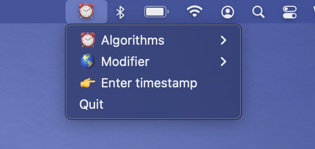

Tempo
=====

What is Tempo?
--------------

Tempo is a lightweight timestamp decoder for MacOS.

Tempo is:

- [x] Free

- [x] Simple

- [x] Quick and dirty

- [x] For MacOS

Tempo is not:

- [ ] Feature rich

- [ ] For Windows or Linux

Support
-------

Supported formats:

- [x] Unix Epoch

- [x] Unix Epoch / 1000

- [x] Cocoa Core Data Timestamp

- [x] Google Chrome
